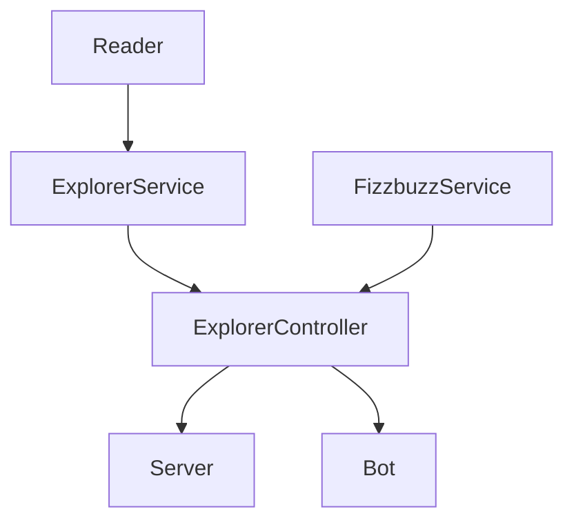

# :fireworks: Bot Telegram Fizzbuzz

Este repo contiene el proyecto de 1 de la semana 5 de Mission Backend NodeJs || Innovaccion Virtual.  
Es una funcionalidad extra de los [ejercicios 1, 2 y 3](https://github.com/herr-code/fizzbuzz) de la semana 4 de Mission Backend NodeJs || Innovaccion Virtual.  
Temas nuevos:

- Creación de un bot para Telegram.

## :pushpin: Requerimientos:

1. Crear un bot con ayuda de BotFather.
2. En `lib/bot.js` configura el bot para que responda lo siguiente:
  - Si recibe un número hace validación de Fizzbuzz.
  - En caso de recibir una cadena como "node" ó "java" debe mostrar la lista de explorers correspondientes a esa misión.
  - Debe mostrar "Número ó string no válido" si no corresponde a alguno de los casos anteriores.

## :chart: Desarrollo

### Parte 1: Crea un nuevo bot de telegram

1. Descarga y crea una cuenta de telegram.
2. Accede al Bot Father: https://telegram.me/BotFather
3. En el chat del bot father envía un mensaje con el texto: `/newbot`
4. Te pedirá un nombre para tu bot, nombralo: `FizzbuzzLaunchXBot`
5. Guarda el token de tu nuevo bot, esta es información sensible. Ejemplo de token: `5112341234:AAFB-c7Jau2TNt0-s6ioQGOAiUtqcsdewdwedwo`.
6. Así mismo te dará una url para que abras un nuevo chat con tu bot, enseguida presiona el botón de START, necesitas realizar este paso.


### Parte 2: Telegram Bot JS

1. Instalar la dependencia necesaria: `node-telegram-bot-api`:

```
npm install node-telegram-bot-api --save
```
2. Crea un nuevo script llamado `lib/bot.js` y configuralo en package.json para ejecutarlo: `"bot": "node ./lib/bot.js"`.


4. El siguiente grafico representa la estructura de la solucíón (sólo se agrega `bot.js`):



## :shipit: Resultados


## :open_file_folder: Estructura de carpetas

```
fizzbuzz
│   .eslintrc.js
│   .gitignore
│   explorers.json
│   package-lock.json
│   package.json
│   README.md   
│
└───github
│   └───workflows
│       │  test.yml
|
└───lib
│   └───controllerss
│   │   │  ExplorerController.js
│   │
│   └───services
│   │   │   ExplorerService.js
│   │   │   FizzbuzzService.js
│   │
│   └───utils
│   │   │   Reader.js
│   │
│   |   server.js
│   
└───test
│   └───controllerss
│   │   │  ExplorerController.test.js
│   │
│   └───services
│   │   │   ExplorerService.test.js
│   │   │   FizzbuzzService.test.js
│   │
│   └───utils
│       │   Reader.test.js

```

:tanabata_tree: Tecnologías usadas:

- Node v13.14.0
- Npm v6.14.4
- Git v2.31.1

:mag_right: Dependencias:

- Express ^4.18.1
- Jest ^28.0.3
- Eslint ^28.0.3
