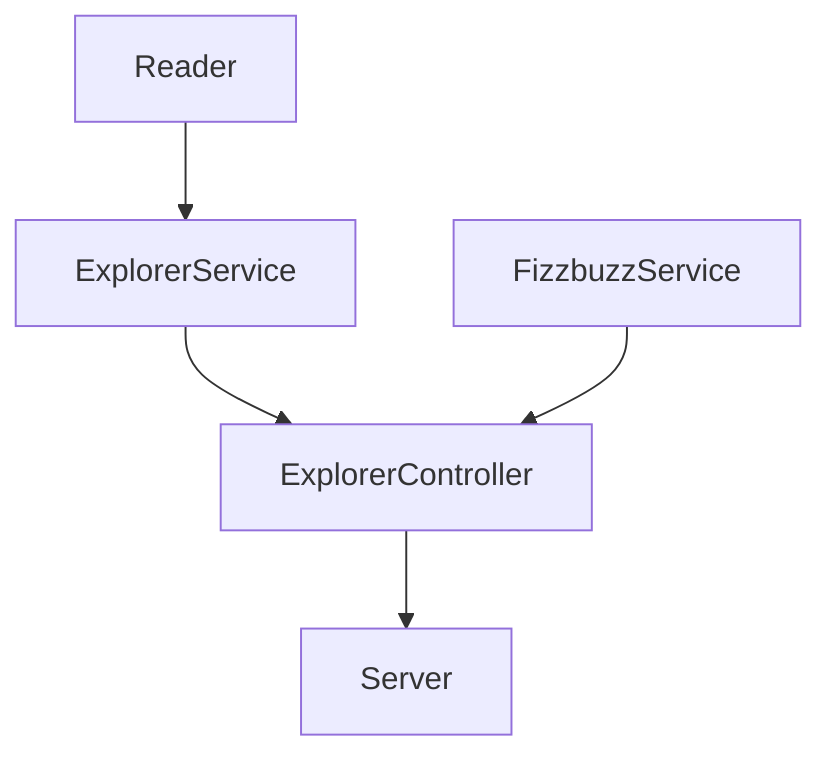

# :fireworks: Fizzbuzz

Este repo contiene el proyecto de los ejercicios 1, 2 y 3 de la semana 4 de Mission Backend NodeJs || Innovaccion Virtual.  
Los temas vistos esta semana son:

- Código legado (modificaciones).
- Refactoring
- POO
- Creación de proyectos de js
- Versionamiento con git y GitHub
- Puebas de unidad
- GitHub Actions (en pruebas automatizadas)
- Linter
- Express
- Lectura de archivos json

## :pushpin: Requerimientos:

1. Refactorizar el script legado y rehacerlo con mucho cuidado ya que es información muy sensible.
2. Crea un API para usar la funcionalidad anterior:

| Endpoint | Request | Response |
|---|---|---|
| `localhost:3000/v1/explorers/:mission` | `localhost:3000/v1/explorers/node` | Deberás obtener la lista de explorers en la misión que enviaste (node o java) |
| `localhost:3000/v1/explorers/amount/:mission` | `localhost:3000/v1/explorers/amount/node` | Deberás obtener la cantidad de explorers según la misión que enviaste (node o java) |
| `localhost:3000/v1/explorers/usernames/:mission` | `localhost:3000/v1/explorers/usernames/node` | Deberás obtener la lista de usernames en la misión que enviaste (node o java) |

3. Nuevo requerimiento: Crea un endpoint para recibir un número y aplicar la validación del fizzbuzz. (ESTO SE DEBE CREAR DESDE CERO)

## :chart: Desarrollo

1. Crear un proyecto de JS dentro de la carpeta `fizzbuzz` con las opciones por defecto:

```
npm init --yes
```

2. Inicializar un repositorio dentro de la carpeta `fizzbuzz`:

```
git init
```
3. Instalar las dependencias necesarias: `Express JS`, `Jest JS` y `Eslinter`:

```
npm install express --save
npm install --save-dev jest
npm install eslint --save-dev
```

4. El siguiente grafico representa la estructura de la solucíón:


5. Se crearon las clases necesarias tanto para el flujo de trabajo como para las pruebas unitarias. Para simular datos de una BD se usa el archivo `explorers.json`

6. Se crea el archivo `test.yml` en `fizzbuzz/.github/workflows/` con el siguiente github action:

```yml
name: Run Tests in my project every push on GitHub

on: [push]

jobs:
  build:
    runs-on: ubuntu-latest
    steps:
    - uses: actions/checkout@v1
    - name: Install modules
      run: yarn
    - name: Run tests
      run: yarn test
```
Esto automatiza nuestras pruebas al hacer `git push`.

## :shipit: Resultados

- Endpoint 1:
  - Request => localhost:3000/v1/explorers/node (10 resultados)
  - Request => localhost:3000/v1/explorers/java (5 resultados)
  - Request => localhost:3000/v1/explorers/groovy (0 resultados)

```js
app.get("/v1/explorers/:mission", (request, response) => {
    const mission = request.params.mission;
    const explorersInMission = ExplorerController.getExplorersByMission(mission);
    response.json(explorersInMission);
});
```


- Endpoint 2:
  - Request => localhost:3000/v1/explorers/amount/node (quantity: 10)
  - Request => localhost:3000/v1/explorers/amount/java (quantity: 5)
  - Request => localhost:3000/v1/explorers/amount/groovy (quantity: 0)

```js
app.get("/v1/explorers/amount/:mission", (request, response) => {
    const mission = request.params.mission;
    const explorersAmountInMission = ExplorerController.getExplorersAmonutByMission(mission);
    response.json({mission: request.params.mission, quantity: explorersAmountInMission});
});
```


- Endpoint 3:
  - Request => localhost:3000/v1/explorers/usernames/node (10 resultados)
  - Request => localhost:3000/v1/explorers/usernames/java (5 resultados)
  - Request => localhost:3000/v1/explorers/usernames/groovy (0 resultados)

```js
app.get("/v1/explorers/usernames/:mission", (request, response) => {
    const mission = request.params.mission;
    const explorersUsernamesInMission = ExplorerController.getExplorersUsernamesByMission(mission);
    response.json({mission: request.params.mission, explorers: explorersUsernamesInMission});
});
```


## :open_file_folder: Estructura de carpetas

```
fizzbuzz
│   .eslintrc.js
│   .gitignore
│   explorers.json
│   package-lock.json
│   package.json
│   README.md   
│
└───github
│   └───workflows
│       │  test.yml
|
└───lib
│   └───controllerss
│   │   │  ExplorerController.js
│   │
│   └───services
│   │   │   ExplorerService.js
│   │   │   FizzbuzzService.js
│   │
│   └───utils
│   │   │   Reader.js
│   │
│   |   server.js
│   
└───test
│   └───controllerss
│   │   │  ExplorerController.test.js
│   │
│   └───services
│   │   │   ExplorerService.test.js
│   │   │   FizzbuzzService.test.js
│   │
│   └───utils
│       │   Reader.test.js

```

:tanabata_tree: Tecnologías usadas:

- Node v13.14.0
- Npm v6.14.4
- Git v2.31.1

:mag_right: Dependencias:

- Express ^4.18.1
- Jest ^28.0.3
- Eslint ^28.0.3
